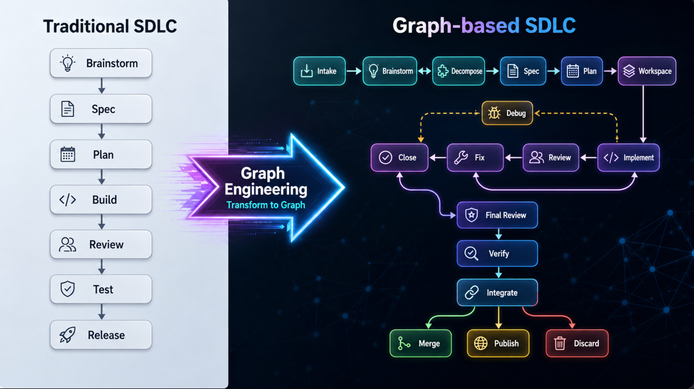
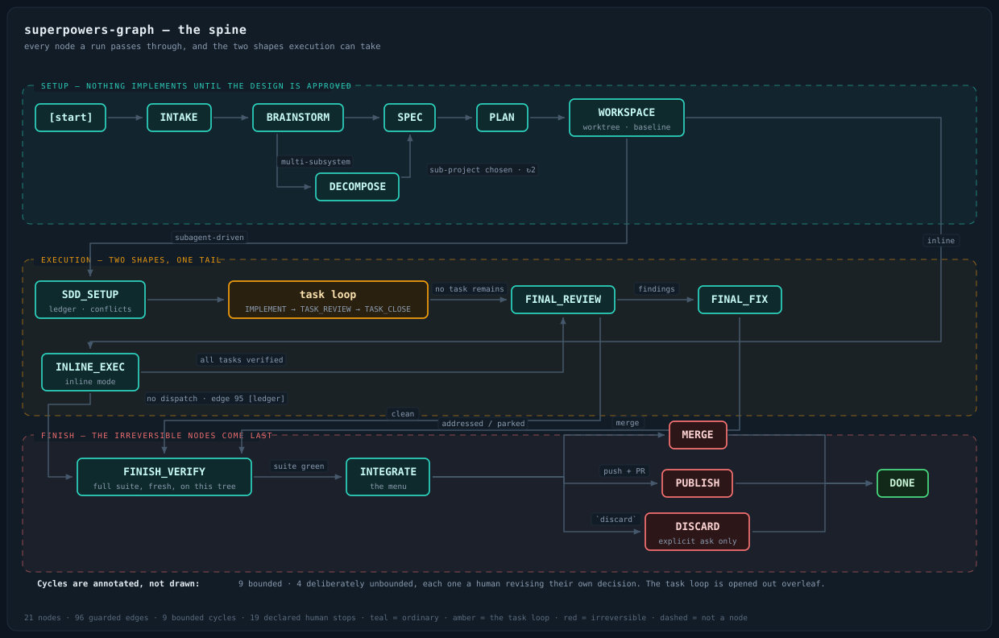

# SDLC Graph Engineering

**Turn the process you already have into a graph a machine can actually execute.**

A [Claude Code](https://code.claude.com) plugin that takes your existing process — a set of skills, a
runbook, a CI config, or something you can only describe out loud — and installs it as a **guarded
graph**: typed nodes, *total* exit guards, bounded retry loops, a durable run-state file that
survives a crash, and a ledger of every step that could not run.

It writes the orchestrator that walks the graph, the auditor that checks it, and the eval suite that
keeps it honest — into *your* project. Then it proves the result sound before handing it over.

[](LICENSE)
&nbsp;
&nbsp;
&nbsp;



---

## Watch it work

VARIANT-BARE

https://github.com/RonMizrahi/sdlc-graph-engineering/releases/download/demo-assets/sdlc-graph-demo-2min.mp4

VARIANT-IMG


Two minutes, no audio. Not seeing a player? [Watch it on YouTube](https://www.youtube.com/watch?v=qrY74MvaVoU).

---

## Example output

Example — superpowers as a graph (by [obra/superpowers](https://github.com/obra/superpowers)),
produced by this plugin: **21 nodes, 96 guarded edges, 9 bounded cycles, 19 declared human stops** →
[RonMizrahi/superpowers-graph](https://github.com/RonMizrahi/superpowers-graph).



Read it as a state machine, not a flowchart. Guards are evaluated in table order and **exactly one
must match** — zero matching guards is a defect that halts the run, never a stall the graph guesses
its way out of. Cycles are annotated rather than drawn: 9 bounded, and 4 deliberately unbounded
because each one is a human revising their own decision, which is a conversation and not a retry.

*Your* graph will look nothing like this one — different nodes, different guards, your process. What
carries over is the structure: total guards, bounded cycles, typed stops, a ledger.

---

## Why prose processes fail

A process written as prose fails in ways prose cannot describe:

| | |
|---|---|
| **No run state** | Nothing records where it got to. An interruption restarts from guesswork. |
| **Unevaluated conditions** | *"retry if it's worth retrying"* is a condition nothing ever checks. |
| **Unbounded loops** | A retry with no declared limit runs until something else stops it. |
| **No record of what was skipped** | *"Never claim a step you didn't run"* is unenforceable if nothing records the absence. |
| **Invented human stops** | With no declared stop list, an agent invents them — and a 20-node run becomes 20 interruptions. |

Every one of those nine cycles already existed in the prose. None of them named a limit.

---

## Install

```
/plugin marketplace add RonMizrahi/sdlc-graph-engineering
/plugin install sdlc-graph-engineering@sdlc-graph-engineering
```

Then, in the project you want a graph for:

```
Install graph engineering here.
```

Or invoke it directly: `sdlc-graph-engineering:sdlc-graph-engineering-install`.

It also triggers on the things people actually say — *"turn my workflow into a graph"*, *"make this
runbook executable"*, *"my agent loses track halfway"*, *"it retries forever"*, *"it says it did
things it didn't do"*.

**No dependencies.** No other plugin, no npm install, no runtime. The eval suite it emits is plain
Python 3 with an empty import list.

---

## What it writes into your project

```
<your project>/
├── agents/
│   └── <graph>-monitor.md         the auditor — read-only, reports, never gates
└── skills/<graph>/
    ├── SKILL.md                   the orchestrator: dispatch loop, rules, human stops
    ├── references/
    │   ├── nodes.md               node contracts + diagrams
    │   ├── edges.md               the transition table, the bounds, the terminal states
    │   └── state.md               run-state schema, write points, resume rules
    └── evals/                     the traces, made executable — runs on every edit
```

Plus a **trace report** (three scenarios, each transition and the guard that fired), a **summary**
(nodes, edges, bounded cycles, human stops, every step whose tools may be absent), and a **green
eval run with its coverage line** — *N/N edges, N/N nodes*. Anything less names the gap.

---

## The method

Nine steps. **Step 4 carries the weight** — the rest is drawing boxes.

| | Step | The point |
|---|---|---|
| 1 | **Inventory** | Every step in the user's own words — including *how it can fail*, which prose always omits. |
| 2 | **Decide what is a node** | A step is a node when it can fail, retry, be skipped, or be resumed into. Fewer nodes with real contracts beat many with vague ones. |
| 3 | **Contract every node** | `inputs` · `action` · `emits` · **`exits`** · guards · `on failure` · `max attempts` · `requires` · `human`. |
| **4** | **Make the guards total** | **Every exit matches exactly one guard.** Not zero — a legal outcome that halts the run. Not two — an ambiguous transition. |
| 5 | **Bound every cycle** | Count per-item, never globally. Never reset a counter, only key it. Plus a global step ceiling. |
| 6 | **Type the human stops** | `approval-after` · `choice-after` · `confirm-before` · `await-external` · `escalation` — then **declare the list complete**. |
| 7 | **Design the run state** | One file, written on *every* transition, *before* the next node starts. Including the ledger. |
| 8 | **Emit the files** | Model files, the orchestrator, the monitor, and the observability surface the state file has already paid for. |
| 9 | **Prove it** | Dry-trace the happy path, a retry that recovers, a retry that exhausts — then **emit those traces as an executable suite**. |

### The trap step 4 exists to catch

Guard sets get written exhaustive over the **happy predicates** but not over their **product**. A
result with three independent properties has eight combinations; the three obvious guards cover
four. Reading a spec top-to-bottom never reveals the gap, because each guard looks correct in
isolation.

Worse: a field that can be `null`, absent, unknown or pending has more than two values, so a guard
pair written `X` / `NOT X` doesn't cover it — it silently folds the third value into one branch,
usually the one that skips work. **It doesn't halt when it's wrong**, which is what makes it worse
than a missing guard.

> Formally this is van der Aalst's **option to complete**: from every reachable state, the end must
> remain reachable. A guard gap is a state from which it is not.

### And the reason to build a graph at all

> **The ledger is the load-bearing part.** Any process can claim it ran a step. Only one that
> records the *absence* can be trusted when it says it did.

---

## What ships with it

| File | Load at | Contents |
|---|---|---|
| **`SKILL.md`** | — | The nine-step method, the output contract, the validation checklist, and the rules for changing a graph that already has runs. |
| **`references/templates.md`** | step 8 | Skeletons for all five files, with the fields that matter already present rather than left to be remembered: `exits`, typed human stops, per-item attempt keys, the append-only ledger. |
| **`references/evals.md`** | step 9b | The eval suite in full — fixture format, how to write a check that reads as a diagnosis, what belongs in a negative control, and the scoping trap. |
| **`references/failure-modes.md`** | step 4 | **16 runtime failure modes**, each with its published name where one exists, so a defect is searchable rather than folkloric — workflow-net soundness, sequence manipulation (MAST FM-3.2), ping-pong livelock, the re-execution hazard, MAST FM-1.4, OWASP ASI01, the zombie-task stall, the surface that lies about the graph, the stop that fires where the human said *continue*, the obligation whose trigger is a judgement call. Plus a *what not to monitor* list, because a checker that fires constantly gets ignored. |

---

## Philosophy

- **A paper trace protects exactly one version of the graph.** Emit the traces as a suite and gate on
  coverage: every node entered, every edge traversed. A change that leaves the suite green without
  touching it has almost certainly added something untested.
- **A suite that cannot fail is not evidence.** Every graph ships a negative control — a file of
  deliberate violations the checker *must* reject.
- **Derive, never duplicate.** The moment a summary table and the node contracts each state the same
  six stops, they can disagree — and the summary is what people read.
- **Put the irreversible node last.** A verification step placed after the point of no return still
  runs, still reports honestly, and is still worthless.
- **Report, never gate.** The auditor is read-only. A monitor that halted runs would become a seventh
  human stop, right after you declared the list complete.
- **Tooling around a graph should be lighter than the graph.**

---

## When *not* to use it

- **The process is genuinely linear** — no branching, no retries, no human stops. A checklist is the
  right tool; a graph is overhead.
- **The steps are one action each.** A graph earns its cost across steps that can fail, retry, or be
  skipped — not around a single tool call.

---

## Layout

```
.claude-plugin/marketplace.json                    marketplace manifest
plugins/sdlc-graph-engineering/
├── .claude-plugin/plugin.json                     plugin manifest
└── skills/sdlc-graph-engineering-install/
    ├── SKILL.md                                   the method
    └── references/{templates,evals,failure-modes}.md
docs/assets/                                       diagrams
CLAUDE.md                                          repo operating guide
```

## Contributing

Issues and PRs welcome. Two things make a change easy to accept:

1. **Say which failure it prevents.** Every rule in this skill is there because a real graph broke
   without it — `references/failure-modes.md` is the running list, and new rules belong beside a new
   entry.
2. **`main` is PR-only**, and every change bumps the plugin `version` in *both* manifests so
   installed users actually receive it.

Skill authoring follows the open [Agent Skills](https://code.claude.com/docs/en/skills) spec; validate
with `claude plugin validate ./plugins/sdlc-graph-engineering --strict` before opening a PR.

## Credits

By [Ron Mizrahi](https://github.com/RonMizrahi).

## License

MIT — see [LICENSE](LICENSE).
