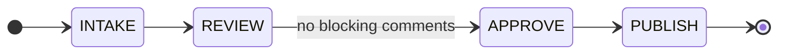

# Templates

Skeletons for the four files. Fill them from the inventory; delete what your domain does not need.

The worked fragments below use a **document-review pipeline** — deliberately not software delivery,
to make clear that nothing here is domain-specific.

---

## `SKILL.md` — the orchestrator

````markdown
---
name: <graph-name>
description: >-
  <What the graph does, end to end.> Keeps run state in `<state-dir>/<run-id>-state.json` so a run
  survives interruption and resumes where it stopped, bounds every retry loop, and records every step
  that could not run instead of passing it silently. Invoke to start a run, resume one, or report
  status.
disable-model-invocation: true   # a whole process should not start on a description match
user-invocable: true
---

# <Graph Name>

## Rules

**1. Follow the graph end to end. Stop only where the graph says to stop.**
The human stops below are the complete list. Everywhere else, decide and continue.

**2. Never report a step as passed when it did not run.** Absent tool, empty input, dead worker —
each gets a ledger entry and the step is **not** marked passed.

**3. When no guard matches, halt and report. Never improvise a transition.**
Zero matching guards is a defect in the graph, not a decision for you.

**4. If the graph does not model your situation, that is a defect to report — not semantics to
invent.** Do not invent a value and improvise the consequences.

**5. Never widen your own bounds.** When a bound is exhausted, stop.

**6. Write the state file before the next node starts.**

## Workflow

1. **Establish the run** — start creates state; resume reads it and **re-derives progress from the
   world**, not from what the file says was intended.
2. **Preflight `requires`** — a missing tool appends to the ledger and the node may not pass.
3. **Run the node** per its `owner`.
4. **Evaluate exit guards in `edges.md` order.** Exactly one must match. Zero → halt and record.
5. **Write state** before the next node starts.
6. **Respect the bounds.** Never grant an extra attempt.

## Human stops — <n> places, and nowhere else

| Stop | Node | Type | What it needs |
|---|---|---|---|
| … | `<NODE>` | `approval-after` | … |

Every other node runs start to finish without asking.

## Output Contract
1. `<state-dir>/<run-id>-state.json`, written on every transition.
2. A final report: what completed, **what was skipped and why**, follow-ups.

## References
- `references/nodes.md` · `references/edges.md` · `references/state.md` — load before the first transition.
````

---

## `nodes.md` — the contracts

````markdown
# Node Catalog

## The contract

| Field | Meaning |
|---|---|
| **owner** | inline · a reference file · a named skill · a script · an agent |
| **inputs** | What it reads from state. It may read nothing else. |
| **action** | What it does. |
| **emits** | What it writes. Anything not listed is not written. |
| **exits** | **Every result this node can produce.** Each must match exactly one guard. |
| **exit guards** | `condition → next node`, in order. **Exactly one must match.** |
| **on failure** | Where control goes when the action fails rather than returning a result. |
| **max attempts** | Re-entry bound, counted in `attempts["<NODE>:<item-id>"]`. |
| **requires** | External tool. **Absent → ledger entry; never recorded as passed.** |
| **human** | `none` · `approval-after` · `choice-after` · `confirm-before` · `await-external` · `escalation` |

## Diagram

Draw the **spine** and each **sub-loop** separately. Annotate cycles rather than drawing them —
retry edges crossing the middle are what makes one-picture diagrams unreadable.



## <NODE_ID>

| | |
|---|---|
| **owner** | … |
| **inputs** | … |
| **action** | … |
| **emits** | … |
| **exits** | `clean` · `needs-revision` · `tool-absent` |
| **exit guards** | `clean → APPROVE` · `needs-revision AND attempts < 2 → REVIEW` · `needs-revision AND budget spent → APPROVE, recorded` |
| **on failure** | … |
| **max attempts** | 2 |
| **requires** | … |
| **human** | `none` |

> A callout for anything a future reader would otherwise "simplify" back out — especially a clause
> that looks redundant but is load-bearing, or one that looks missing but was deliberately removed.
````

---

## `edges.md` — transitions and bounds

````markdown
# Transition Table

## How transitions are evaluated

1. The node finishes and returns its result.
2. Guards are evaluated **in table order**. **Exactly one must match.**
3. The transition is appended to `history[]` and state is saved **before** the next node starts.

**Zero matching guards is a bug, not a stall.** Halt, record the node, every guard tested, and what
was tried. **Never guess a transition.**

| # | From | To | Guard | Bound |
|---|---|---|---|---|
| 1 | `[start]` | `INTAKE` | run created | — |
| 2 | `INTAKE` | `REVIEW` | document loaded | — |
| 3 | `REVIEW` | `REVIEW` | blocking comments **and** `attempts < 2` | **2** |
| 4 | `REVIEW` | `APPROVE` | no blocking comments **or** budget spent | — |

## Loop bounds

**Every cycle, with its bound and what happens on exhaustion.** An unbounded cycle is the failure this
table exists to prevent.

| Cycle | Edges | Bound | On exhaustion |
|---|---|---|---|
| `REVIEW` ↻ | 3 | 2 | proceed, comments recorded |

**Counters are keyed per item, never reset.** A reset hands a stuck loop an unlimited budget.

**Global ceiling:** `history.length > <N>` ⟹ halt. Every cycle can be individually in bounds while the
run never converges.

**Exception:** a loop whose other side is a human revising their own decision is a *conversation*, not
a retry. Leave it unbounded and say so — bounding it cuts off the cheapest correction available.

## Terminal states

| State | Meaning |
|---|---|
| `DONE` | Reached the end. **Not necessarily clean** — read the ledger. |
| `BLOCKED` | Something failed. Records the node, every guard tested, what was tried. Resumable. |
| `HANDOFF` | A deliberate stop with nothing wrong. Needs action, not diagnosis. |
````

---

## `state.md` — the run state

````markdown
# Run State

`<state-dir>/<run-id>-state.json`, written on **every** transition, **before the next node starts.**

```json
{
  "run_id": "",
  "node": "REVIEW",
  "status": "RUNNING",
  "context": { "…": "whatever the guards read" },
  "items": [ { "id": 1, "name": "", "node": "", "deps": [] } ],
  "cursor": { "item": 1 },
  "attempts": { "REVIEW:1": 1 },
  "blocked": null,
  "skipped_steps": [ { "node": "", "reason": "", "at_item": 1 } ],
  "history": [ { "from": "INTAKE", "to": "REVIEW", "guard": "document loaded", "item": 1 } ]
}
```

## Fields

| Field | Notes |
|---|---|
| `node` | Where the run **is**, not the last thing completed. |
| `status` | `RUNNING` · `BLOCKED` · `HANDOFF` · `DONE`. Keep a deliberate stop distinct from a failure. |
| `attempts` | Keyed `"<NODE>:<item-id>"`. **The single authority for every bound.** Never reset. |
| `blocked` | `{ node, guards_tested[], tried[], at_item }`. `guards_tested` is a **list** — a zero-match halt has a *set* that all failed, not one. |
| `skipped_steps[]` | **The ledger. Append-only.** Every step that could not run, with its reason. |
| `history[]` | Every transition, append-only. `guard` quotes `edges.md` **verbatim**, so the trail can be matched against the table. |

## Resume

1. Read the file.
2. **Re-derive progress from the world** — not from what the file says was intended. The file says
   *where to look*; the filesystem, the API, the database are the truth. A run may have died
   *mid-node*, leaving partial work.
3. Re-run the node from that point.

**Never rewind `attempts` or the ledger.** Rewinding hands a stuck loop an unlimited budget.

## Secrets

This file is durable and often committed. **No credentials, no tokens, no connection strings, no raw
command output** — logs carry secrets. Identifiers only; resolve secrets from the environment at use
time and never write them back.
````

---

## Project instructions — the twin rules the installer must write

When any node's procedure was **copied** from an existing skill (step 2b), the graph cannot enforce
these by itself: they belong in the project's own always-loaded instructions.

```markdown
## Twinned procedures — ASK BEFORE CHANGING EITHER SIDE

These exist twice: the standalone skill, and a graph-scoped copy at
`<graph-root>/references/<name>-node.md`, trimmed to that node's role.

Before editing either side, STOP and ask which side the change belongs to. Never propagate
silently; never let them diverge silently. **A divergence is often correct** — the copy was
trimmed on purpose, so "make them identical" is the wrong default. Each copy carries
`copied-from:` / `trimmed:` / `diverged:` headers; use them.

Twins: <name> · <name> · <name>        <!-- enumerated, not a category -->

## While a run is active, the triggers above are SUSPENDED

A run is active when `<state-file>` has `status: RUNNING` or `BLOCKED`.
While it is, **do not load any standalone twin** — the graph carries its own trimmed copies and
those are authoritative. Loading a standalone twin mid-run is actively harmful, not merely
redundant: it re-introduces the orchestration that was trimmed out, and the loop runs twice.

What the graph loads itself is its own business — it deliberately live-dispatches the current
installed version of <standards / external tools>. Let it call those at the node that needs them.
```

## The observability surface — no skeleton on purpose

There is no template here for the viewer/dashboard of step 8c, and that is deliberate: its shape
depends entirely on the domain, and a copied HTML skeleton would be the very drift failure mode 13
describes. What it must satisfy is a contract, not a layout —

| | |
|---|---|
| **reads** | the run-state file, and nothing else |
| **writes** | nothing, ever — the orchestrator is the single writer |
| **refresh** | re-read on an interval; never stop at a terminal state |
| **renders** | run content as text, never as markup |
| **declares** | the `schema_version` it mirrors, visibly, and warns on mismatch |
| **gates** | nothing — absent is one line in the run report, never a failure |
| **config** | in a file the next agent can read, not in a process environment |

## `agents/<graph-name>-monitor.md` — the auditor

Lives in `agents/`, **not** `references/`. A reference is a file a skill *reads*; an agent is a
separate context that gets *spawned*. Plugin agents are addressed by scoped name —
`<plugin>:<agent-name>` — and the bare name will not resolve.

````markdown
---
name: <graph-name>-monitor
description: >-
  Audits a <graph-name> run for the ways these graphs fail: a result matching zero exit guards, a step
  passed that never ran, a retry loop that isn't being counted, and a decision that exists only in the
  transcript. Read-only — reports, never remediates or prompts. Invoke as
  `<plugin>:<graph-name>-monitor` on BLOCKED, before the terminal state, or when a run feels wrong.
tools: Read, Grep, Glob, Bash
---

# <Graph Name> Monitor

## Goal
One question: **is this run doing what the graph says it is doing?**

## Inputs
`state_path` · `graph_root` (reads nodes/edges/state as the spec) · `repo` · `transcript` *(optional —
without it, the transcript-only checks cannot run, and you must say so)*.

## Checks
Derive from **this** graph. At minimum:

**Trail integrity** — every `history[].guard` appears verbatim in `edges.md`; every `(from,to)` is a
declared edge; `history[i].to == history[i+1].from`; the last entry matches `state.node`.

**Zero-guard halts** — `guards_tested.length > 1 && tried == []` means a **zero-match halt**, not
bound exhaustion. They need completely different fixes; classify correctly.

**Unearned passes** *(highest severity)* — no step exits on a pass-shaped guard while the ledger holds
an entry for it at that item. Cross-check any claim against the world: if a step says it changed
something, verify it changed.

**Cycle accounting** — transitions into a node equal its counter plus one. Drift means the bound is
decorative.

**State integrity** — every field a node reads is written by some node first; counters never decrease;
the ledger never shrinks.

## What NOT to flag
A non-empty ledger *(designed)* · deliberately unbounded human-revision loops · a deliberate stop
status · reaching the end with a non-empty ledger · state disagreeing with the world *(resume requires
re-deriving from it)* · anything needing judgement — surface it, never rule on it.

## Output
**One file:** `<state-dir>/<run-id>-monitor-<date>.md` — verdict, summary, findings with verbatim
evidence, **feedback** (the observations a checklist cannot produce), checks passed **and not run**,
and questions for a human. Then return three lines: verdict, counts, path.

**An unrun check is never a pass.**

## Guardrails
Read-only. Writes exactly one file. Never remediates, never prompts, never judges quality.
````
